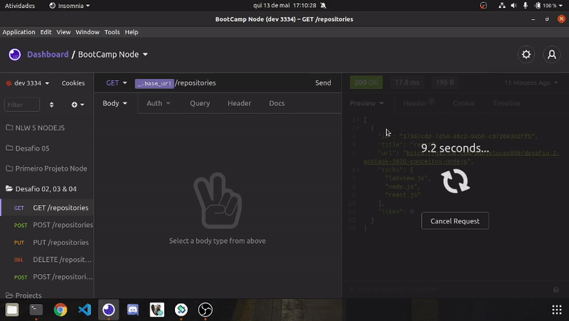

<h1 align="center"> React Native</h1>
<h3 align="center">Repositório destinado ao estudo de React Native</h3>

<h4>Este repositório contém:</h4>

- Exemplos das funcionalidades do React native
- desafio de programação em react fornecido pela rocketseat (solucionado)

